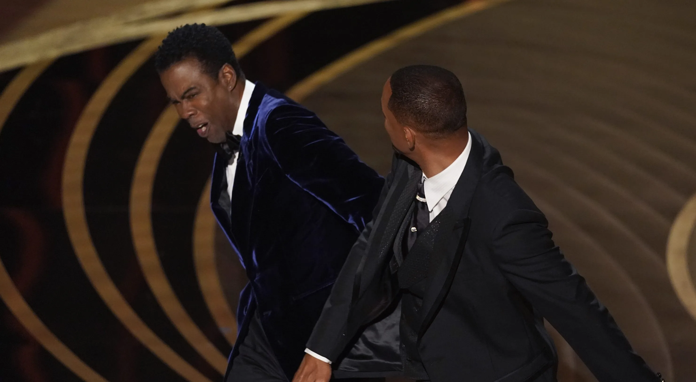
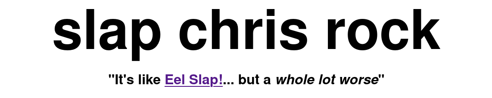
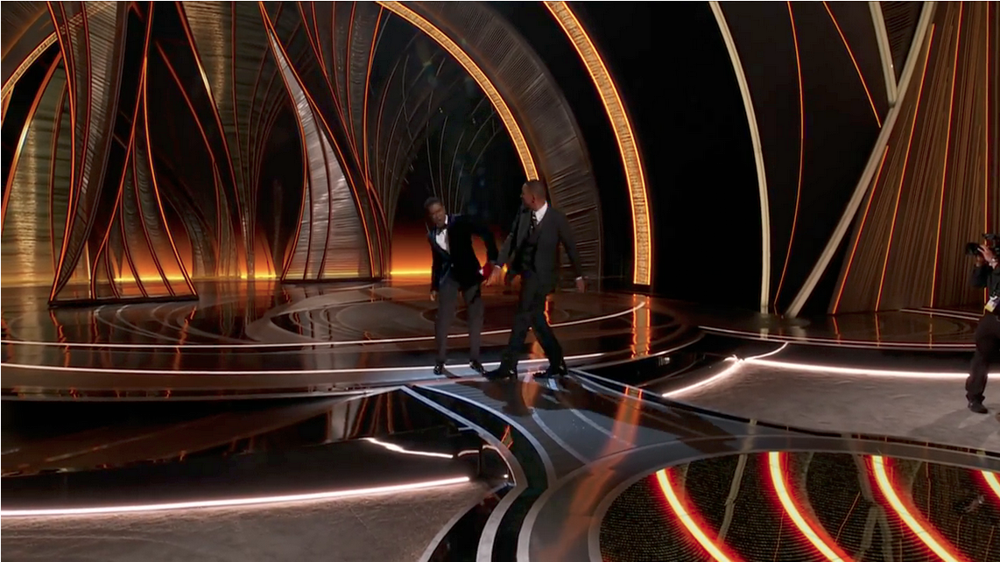

# Slap Chris Rock
Remember that time when Will Smith slapped Chris Rock?

  

Well... you can remake that experience with this website.

## Features
- Slap Chris Rock

## Screenshots

  
   
   
  

## Roadmap
- I saw the slap
- I remembered [Eel Slap](http://eelslap.com/)
- 💡
- Wrote a quick website

## How To Add New Frames?
1. Find a 1280x720 video of the slap on Youtube
2. Cut it down to 41 of it's slappiest of frames
3. Use this [super sexy method](https://stackoverflow.com/a/30228308) that I found and copied for verbatim on StackOverflow to merge the images horizontally
4. Save it and add it under `frames/`

### Some Really Obvious Points That I Still Wanna Make
- A good starting frame would be a few frames right before the slap (maybe a few frames of the walk if REALLY needed).
- A good ending frame would be a few frames right after the slap or after the gag.
- Some slap memes are too long for it to work for an app like this... at the end of the day, it should stick to that 41 frame limit as I have absolutely no clue how to implement it in a way where it compensates for a frame count over/under the expected amount.

## Lessons Learned
- Stop
- Procrastinating
- On
- Schoolwork

## Used By
- Will Smith (probably)

## License
[MIT](https://choosealicense.com/licenses/mit/)

## TODO
- [ ] Make it more responsive
